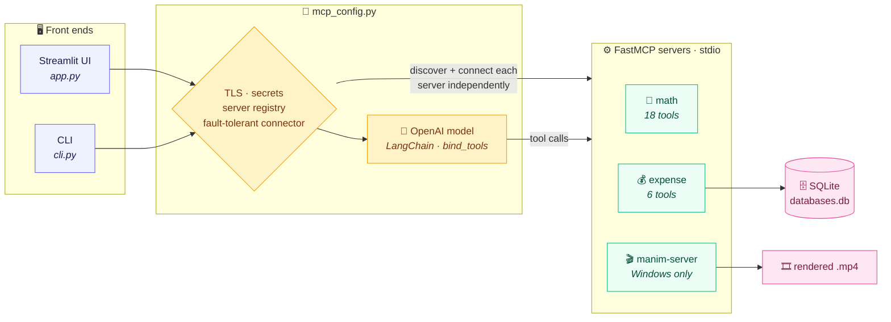
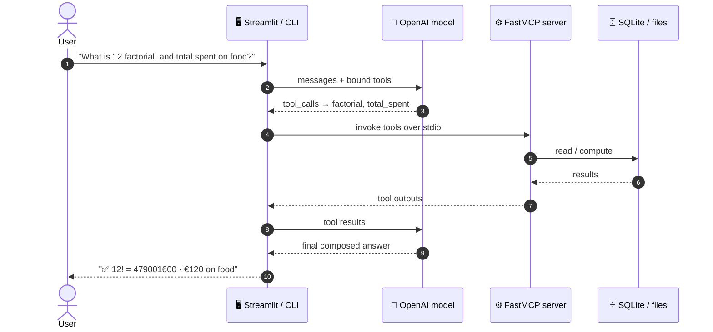

# 🧰 MCP Multi-Server

> One OpenAI assistant, many [Model Context Protocol](https://modelcontextprotocol.io/) servers — math, expense tracking, and animation — behind a Streamlit chat UI and a CLI.

[](https://github.com/Amith-Ganta/MCP-Multi-Server/actions/workflows/ci.yml)
[](https://www.python.org/downloads/)
[](https://github.com/astral-sh/ruff)
[](LICENSE)

**🚀 Live demo: [mcp-multi-server-deployment.streamlit.app](https://mcp-multi-server-deployment.streamlit.app/)**

---

## Overview

This project demonstrates a production-shaped pattern for building an LLM agent
on top of the **Model Context Protocol (MCP)**. A single OpenAI chat model is
bound to tools exposed by several independent MCP servers and orchestrated
through one tool-calling loop. The same configuration layer powers two front
ends:

- **`app.py`** — an interactive Streamlit web app (the live demo).
- **`cli.py`** — a one-shot command-line client for quick checks and scripting.

The design goal is graceful degradation: each server connects independently, so
one failing or unavailable server is reported and skipped rather than taking the
whole app down.

## 🏗️ Architecture

### System overview



Each server is a standalone [FastMCP](https://github.com/jlowin/fastmcp) process
launched over **stdio**, and connects **independently** — if one fails (missing
file, Windows-only, offline), it is shown as failed in the sidebar and skipped,
so the app keeps working.

### Request lifecycle



### Tech stack

| Layer | Technology | Role |
|:--|:--|:--|
| 🧠 **Runtime** | Python ≥ 3.11 | Language runtime |
| 🔌 **Protocol** | FastMCP · MCP over stdio | Standalone tool servers, one subprocess each |
| 🤖 **LLM** | OpenAI + LangChain | Tool-calling orchestration (`bind_tools`) |
| 🖥️ **UI** | Streamlit · CLI | Two front ends sharing one config layer |
| 🗄️ **Data** | SQLite | Local expense store (`databases.db`) |
| 📦 **Tooling** | uv · ruff · pytest | Deps, lint, and the test suite |
| ☁️ **Hosting** | Streamlit Community Cloud | Managed deployment of the web app |

## Tool catalog

### 🧮 Math server — `servers/math_server.py`

Arithmetic, algebra, trigonometry, and basic statistics (18 tools):

| Category    | Tools                                                              |
| ----------- | ----------------------------------------------------------------- |
| Arithmetic  | `add`, `subtract`, `multiply`, `divide`, `modulo`                 |
| Powers      | `power`, `square_root`, `nth_root`                                |
| Integers    | `factorial`, `gcd`, `lcm`                                         |
| Exp / log   | `logarithm`, `exp`                                                |
| Trig (deg)  | `sin`, `cos`, `tan`                                               |
| Statistics  | `mean`, `percentage`                                              |

### 💰 Expense server — `servers/expense_server.py`

A SQLite-backed expense tracker (6 tools). Categories are normalised
(trimmed + lower-cased) on write:

| Operation | Tools                                                  |
| --------- | ------------------------------------------------------ |
| Write     | `add_expense`, `update_expense`, `delete_expense`      |
| Read      | `list_expenses`, `total_spent`, `summarize_by_category`|

### 🎬 Manim server (Windows-only, optional)

Renders [Manim](https://www.manim.community/) animation code to an `.mp4` and
returns the file path. Included automatically only when the local Manim
environment is present, so the cloud deployment runs cleanly without it.

## Quickstart

Requires **Python 3.11+** and an [OpenAI API key](https://platform.openai.com/api-keys).
[`uv`](https://docs.astral.sh/uv/) is recommended.

```bash
# 1. Clone
git clone https://github.com/Amith-Ganta/MCP-Multi-Server.git
cd MCP-Multi-Server

# 2. Configure secrets
cp .env.example .env        # then edit .env and set OPENAI_API_KEY

# 3. Install dependencies
uv sync                     # or: pip install -r requirements.txt

# 4a. Run the web app
uv run streamlit run app.py

# 4b. …or the CLI
uv run python cli.py "What is 12 factorial?"
```

## Deployment (Streamlit Community Cloud)

The app is deploy-ready out of the box:

1. Push this repository to GitHub.
2. On [share.streamlit.io](https://share.streamlit.io/), create a new app with
   **main file** `app.py` and **Python 3.11**.
3. Under **Advanced settings → Secrets**, add (TOML):

   ```toml
   OPENAI_API_KEY = "sk-your-key-here"
   OPENAI_MODEL = "gpt-4o"
   ```

Local servers launch with the deployment's own interpreter, and the Windows-only
Manim server is skipped automatically in the cloud.

## Configuration

| Variable / secret | Required | Default  | Purpose                                   |
| ----------------- | -------- | -------- | ----------------------------------------- |
| `OPENAI_API_KEY`  | Yes      | —        | Authenticates calls to the OpenAI API.    |
| `OPENAI_MODEL`    | No       | `gpt-4o` | Overrides the chat model.                 |

Secrets are read from the environment first (`.env` locally), then from
Streamlit secrets — so the same code runs unchanged locally and in the cloud.
TLS verification is routed through the OS trust store via `truststore`, which
keeps HTTPS working behind corporate TLS-interception proxies.

## Development

```bash
uv sync --extra dev      # install dev tooling (pytest, ruff)
uv run ruff check .      # lint
uv run pytest            # run the test suite (21 tests)
```

The test suite calls the server tool functions directly against isolated
fixtures (a throwaway SQLite database per test), so it needs no network access
and never touches your real data.

CI runs lint + tests on Python 3.11 and 3.12 for every push and pull request to
`main` — see [`.github/workflows/ci.yml`](.github/workflows/ci.yml).

## Project structure

```
.
├── app.py                  # Streamlit web UI
├── cli.py                  # command-line client
├── mcp_config.py           # TLS, secrets, server registry, connector
├── servers/
│   ├── math_server.py      # 18 math tools
│   └── expense_server.py   # SQLite expense tracker (6 tools)
├── tests/                  # pytest suite (math, expense, config)
├── .github/workflows/ci.yml
├── pyproject.toml          # metadata, ruff + pytest config, deps
├── requirements.txt        # pinned deps for Streamlit Cloud (pip)
├── .env.example
└── LICENSE
```

## License

Released under the [MIT License](LICENSE). © 2026 Amith Ganta.
